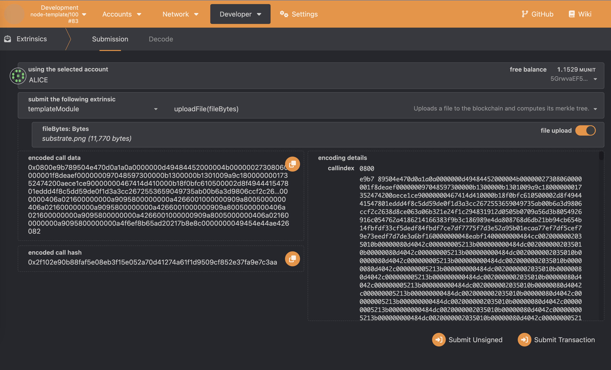
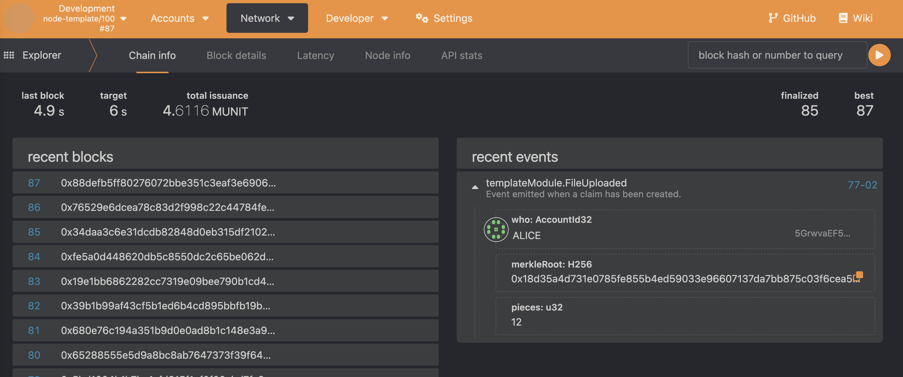

# Trustless File Server Pallet

This pallet intends to be a trustless file server similar to the [Bittorrent](https://www.bittorrent.org/beps/bep_0030.html) protocol.
The main idea is to make extensive use of [merkle trees](https://brilliant.org/wiki/merkle-tree/) to provide cryptographic proofs
of the file's validity.


## Limitations

- In the original Bittorrent protocol, the `sha1` hashing algorithm is used. However, in this implementation the `sha256` is used.
- Files are divided in chunks, with a **fixed chunk size of 1KB**.
- The whole files are stored on the blockchain storage. **This is a very severe limitation and an overall bad practice**. The original idea was
to store files on IPFS and only keep the corresponding hash on the blockchain. However, I found several limitations for using IPFS
in a substrate environment, so I finally decided to store the content directly on the blockchain. Further research would be needed
in order to fix this limitation.


## Walkthrough

This pallet implementation is composed of one extrinsic and two RPC methods. Tests have been performed using
[this file](./img/substrate.png).


### Extrinsics

#### uploadFile

This pallet call accepts the file bytes and uploads them to the blockchain (see [limitations](#limitations)), along with
its corresponding merkle tree and the number of file chunks.






### RPC methods

#### trustless_file_server_get_files

Returns a JSON list of the merkle hashes and number of 1KB pieces of the files being served. This operation simply
iterates through the `StorageMap` and fetches the corresponding data.

Request:
```shell
$ curl http://localhost:9933 -H "Content-Type:application/json;charset=utf-8" -d '{
      "jsonrpc": "2.0",
      "id": 1,
      "method": "trustless_file_server_get_files",
      "params": []
    }'
```

Response:
```json
{
  "jsonrpc": "2.0",
  "result": [
    {
      "merkle_root": "18d35a4d731e0785fe855b4ed59033e96607137da7bb875c03f6cea5d1f8cacf",
      "pieces": 12
    }
  ],
  "id": 1
}
```

#### trustless_file_server_get_proof

Returns the chunk's IPFS hash, along with the cryptographic proof necessary to build up the merkle root.

Request:
```shell
$ curl http://localhost:9933 -H "Content-Type:application/json;charset=utf-8" -d '{
      "jsonrpc": "2.0",
      "id": 1,
      "method": "trustless_file_server_get_proof",
      "params": [null, "18d35a4d731e0785fe855b4ed59033e96607137da7bb875c03f6cea5d1f8cacf", 8]
    }'
```

Response:
```json
{
  "jsonrpc": "2.0",
  "result": {
    "ipfs_hash": "QmaAu1KYkVL7zohejhr8q5q3UFXuaYUAMVs6xQ7FDFxWRU",
    "proof": [
      "ef9cb3436768bad19a78888f63ca77064e53ded49696f816523bea6e61ec36b3",
      "83c5dae86b0768e7bedcca73718523bc8bcfd7eeb6c2c728d0f035ec43aa4d63",
      "db56114e00fdd4c1f85c892bf35ac9a89289aaecb1ebd0a96cde606a748b5d71",
      "73b107c009c3044125c1f12015808b6adcfc44c473e013593f0ca1362bb80955"
    ]
  },
  "id": 1
}
```

##### Error handling:

This RPC method raises an error if the given piece does not exist or the merkle root is invalid.

Request:
```shell
$ curl http://localhost:9933 -H "Content-Type:application/json;charset=utf-8" -d '{
     "jsonrpc": "2.0",
      "id": 1,
      "method": "trustless_file_server_get_proof",
      "params": [null, "18d35a4d731e0785fe855b4ed59033e96607137da7bb875c03f6cea5d1f8cacf", 40]
    }'
```

Response:[main.py](..%2F..%2FDesktop%2Ftest%2Fmain.py)
```json
{
  "jsonrpc": "2.0",
  "error": {
    "code": 1,
    "message": "Runtime error",
    "data": "\"Failure getting the merkle proof\""
  },
  "id": 1
}
```